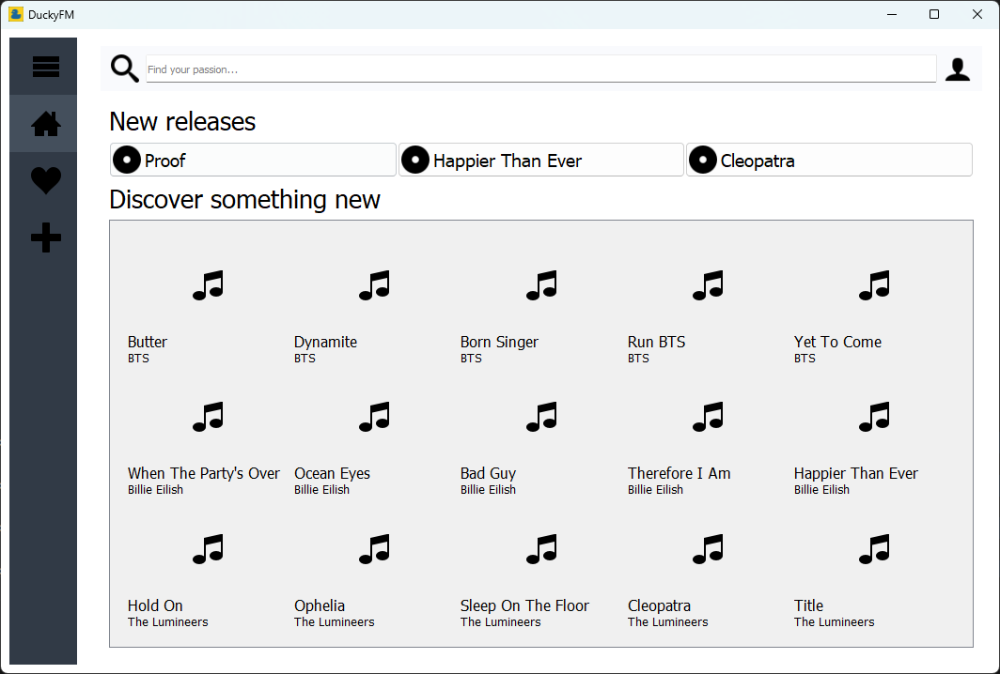
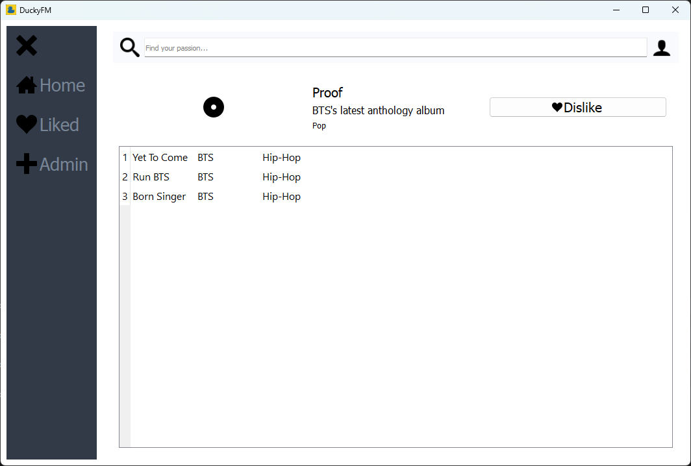
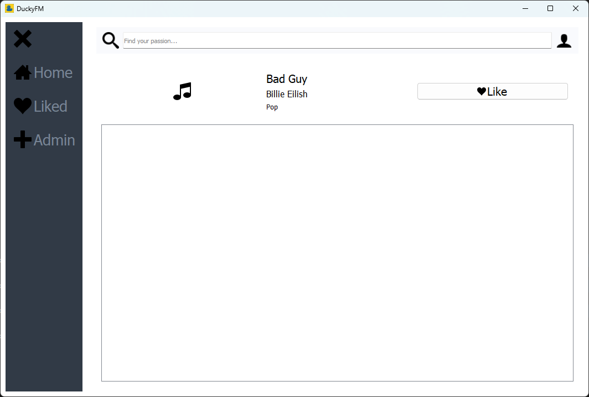
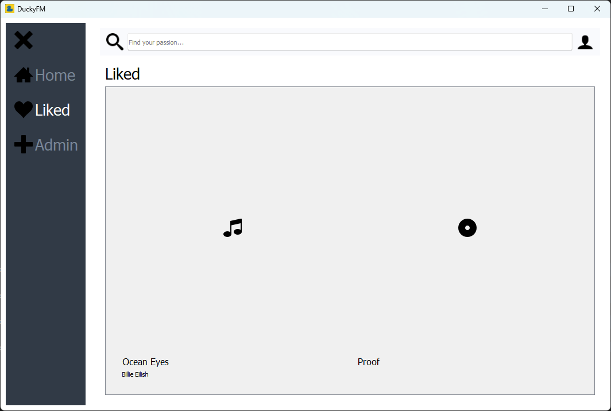
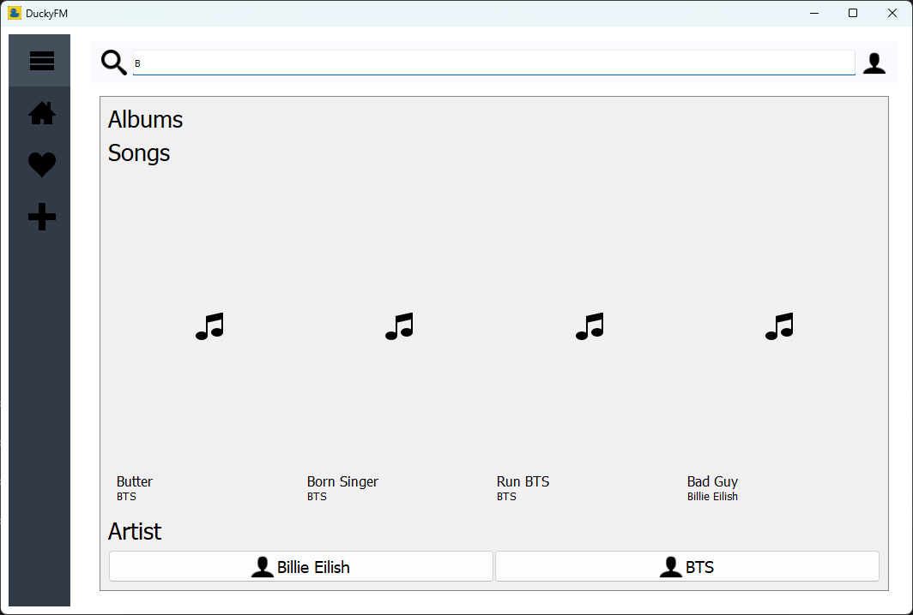
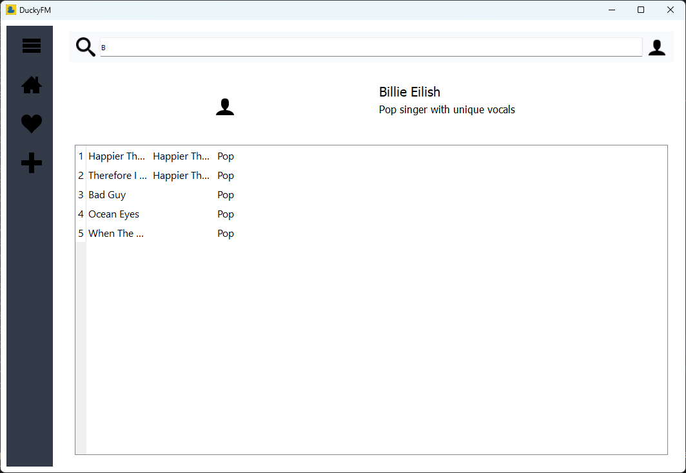
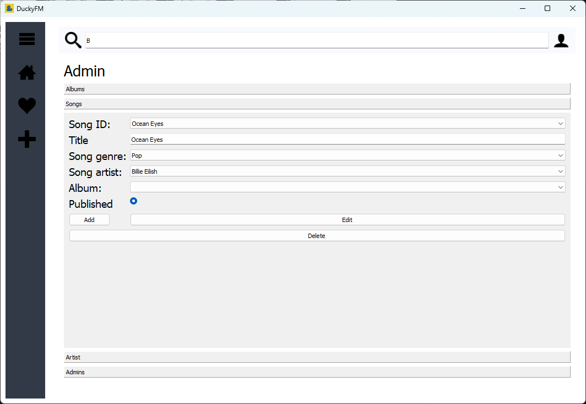
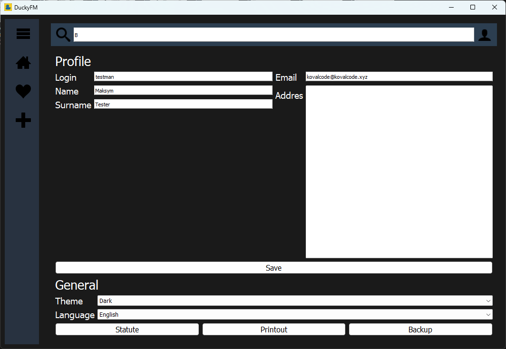
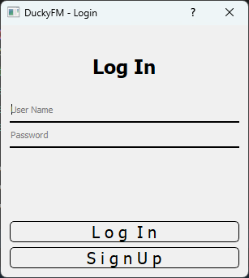
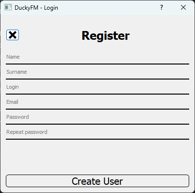

# DuckyFM

> Short one-sentence description or tagline about the project.

## 📄 About

Recording Studio is a music management application that allows you to manage information about albums, artists, and songs. Users can create, edit, and delete information, as well as assign songs to albums and artists.␍
Recording Studio is designed using modern programming technologies. The application is written in Python and uses the PyQt library to create the user interface. Data is stored in an Azure SQL database, which ensures security and availability from various devices.␍
Recording Studio is the ideal tool for anyone who wants to manage their music collection. Whether you have a small collection of your favorite songs or a large library of music, Recording Studio can help you keep track of everything.

## 🚀 Technologies Used

- Python
- PyQt5
- Microsoft Azure

## 🖼️ Screenshots

## 📦 Installation

1. **Install Python**: Download and install Python from the official website.

2. **Install Requirements**: Run `pip install -r requirements.txt` in your command line to install the required dependencies.

3. **Deploy SQL Database**: Set up your SQL database according to your requirements.

4. **Set Environment Variables**: Set the following environment variables:
   - `DB_LOGIN`: _login_to_database_
   - `DB_PASS`: _password_to_database_
   - `DB_SERVER`: _server_adress_
   - `DB_NAME`: _name_of_database_

5. **Run main.py**: Execute `python main.py` in your command line to run the main Python script.
